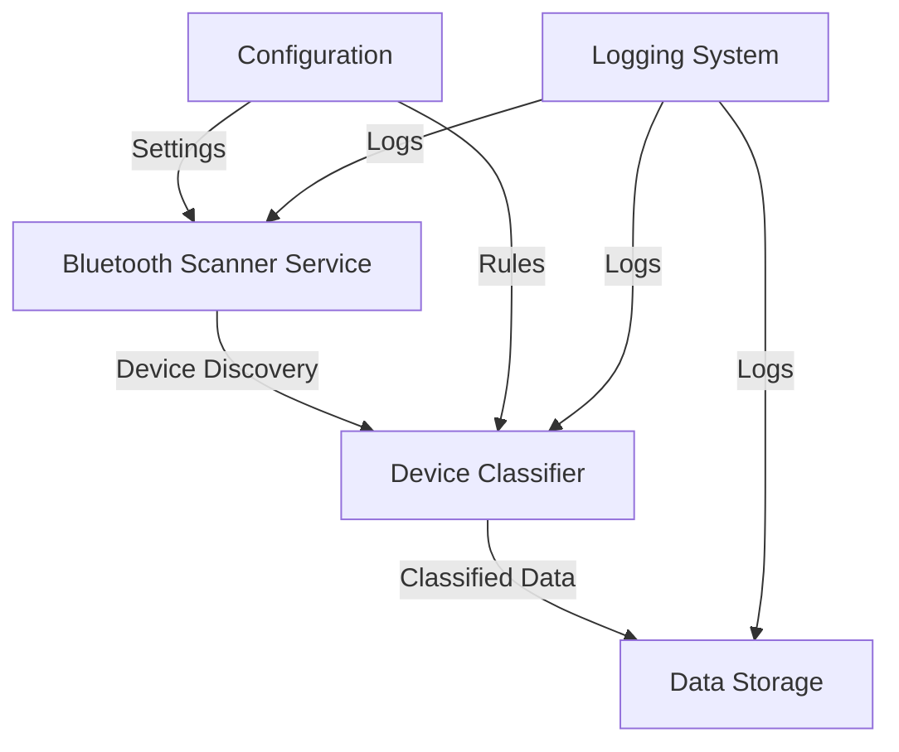
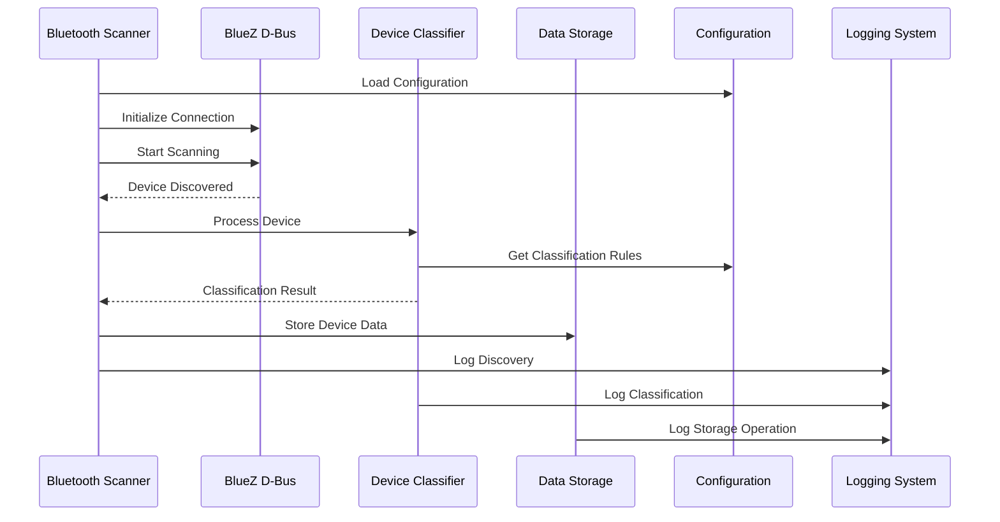
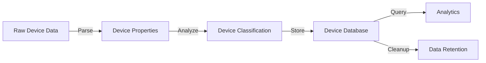
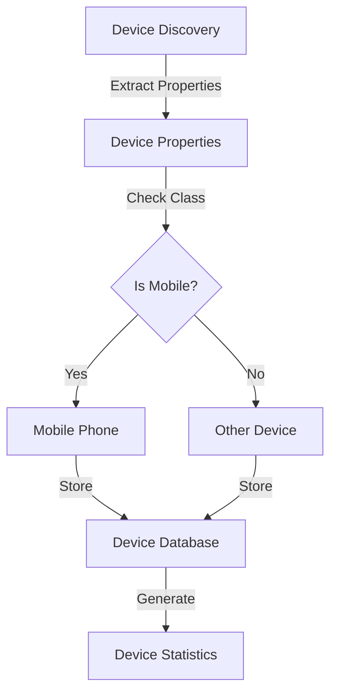
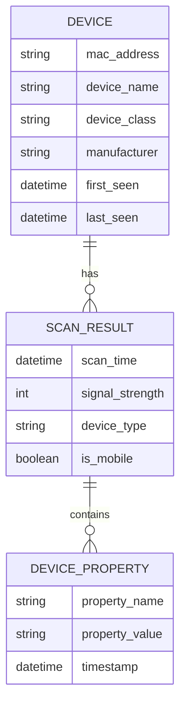

# Bluetooth Device Scanner Data Flow

## System Data Flow Overview

## Component Interaction Flow

## Data Processing Flow

## Device Classification Flow

## Data Storage Schema

## Notes

### Data Flow Considerations
1. **Real-time Processing**
   - Device discovery events are processed immediately
   - Classification happens in real-time
   - Storage operations are asynchronous

2. **Data Integrity**
   - All device data is validated before storage
   - Duplicate entries are handled appropriately
   - Data consistency is maintained across components

3. **Performance Optimization**
   - Batch processing for storage operations
   - Caching of frequently accessed data
   - Efficient query patterns for analytics

4. **Error Handling**
   - Graceful degradation on component failure
   - Data recovery mechanisms
   - Comprehensive error logging 